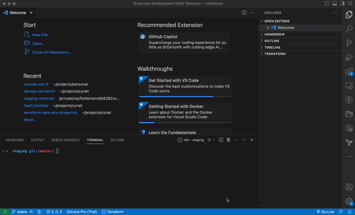
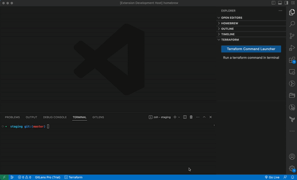

# Ultimate Terraform Launcher
The [Ultimate Terraform Launcher extension for Visual Studio Code](https://marketplace.visualstudio.com/items?itemName=oferkafry.easy-terraform-commands)
adds a **quick launcher** and an **interactive progress indicator** to terraform commands execution.

# More Features
* Eliminate the need for typing commands.
* Provides **interactive notifications** that keep you informed about the command progress as you work.
* Seamlessly integrated with the VS Code terminal.
* Persistence of all commands output.
* No output size limit.

# How to use

#### Click "Terraform" button in status bar
Or
#### Click '⌘⇧T' (Ctrl / Cmd + Shift + T)
 

That's it. You are ready to Go &nbsp;&nbsp; 🎉🎉🎉

 
<em>Running "terraform plan"</em>

### Full output logs

\* **Optionally** you can set folder and credentials for repeated use

 
<em>Running "terraform plan" with credentials and logs</em>

## Notes
* On non-bash terminals (e.g windows cmd) some features are disabled.
* Initial time estimates might not be accurate as the system needs to "learn" the execution times.

## Improvements

Notice any issues, or have an idea on how this extension can improve? Please let me know!

## License

[CC BY-NC-ND](LICENSE)

**Enjoy!**
