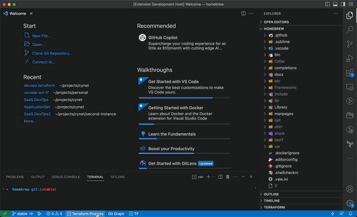
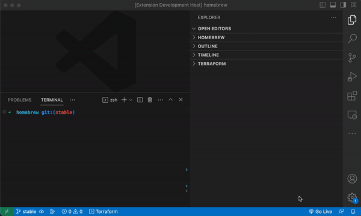

# [Terraform Dashboard Plus](https://marketplace.visualstudio.com/items?itemName=oferkafry.easy-terraform-commands)
A dashboard for Terraform.

# Features
* Easy command runner
* Progress monitor
* **Free** ChatGPT integration

# Examples

 
<em>The dashboard</em>

 
 

 
<em>From sidebar</em>

 
 

 
<em>A Quick Launcher and Progress indicator</em>

 

# How to use

#### Click "Terraform Projects" button in status bar
Or
#### Expand "Terraform" menu in side panel
Or
#### Click '⌘⇧T' (Ctrl / Cmd + Shift + T)

Then click desired command. That's it. You are ready to Go &nbsp;&nbsp; 🎉🎉🎉

 

## Notes
* On non-bash terminals (e.g windows cmd) some features are disabled.
* Initial time estimates might not be accurate as the system needs to "learn" the execution times.

## Improvements

Notice any issues, or have an idea on how this extension can improve? Please let me know!

## License

[CC BY-NC-ND](LICENSE)

**Enjoy!**
