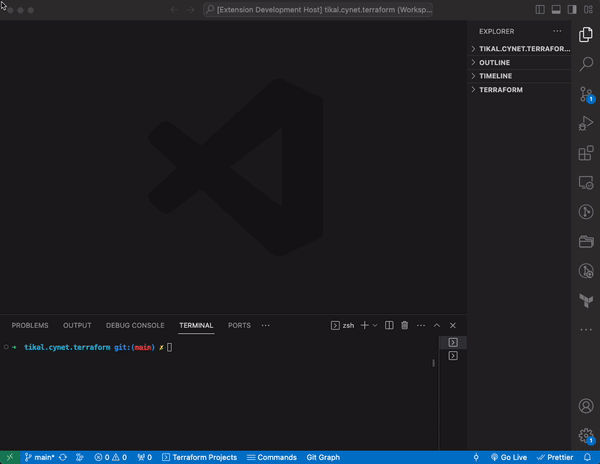
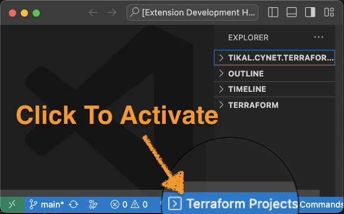

# [Terraform Shortcuts +](https://marketplace.visualstudio.com/items?itemName=oferkafry.easy-terraform-commands)

Say goodbye to tedious typing! the [Terraform Shortcuts +](https://marketplace.visualstudio.com/items?itemName=oferkafry.easy-terraform-commands) VSCode extention brings effortless, UI-driven execution and real-time monitoring of common terraform tasks.

# Features
* Execute terraform commands at a click of a button.
* Work comfortably from within VSCode, unrestricted by integrated terminal limitations.
* Seamlessly navigate and transition between all your Terraform projects.
* Visualize real-time execution progress of Terraform commands with a progress bar.
* Get **Free** ChatGPT insight summary into "terraform plan".

# Demos

 
<em>Interactive Dashboard</em>

 
 

 
<em>Activate from status bar</em>

 

# How to use

#### Click "Terraform Projects" button in status bar
Or
#### Expand "Terraform" menu in side panel
Or
#### Click '⌘⇧T' (Ctrl / Cmd + Shift + T)

Then click desired command. That's it. You are ready to Go &nbsp;&nbsp; 🎉🎉🎉

 

## Notes
* Works best with bash or powershell terminals
* Initial time estimates might not be accurate as the system needs to "learn" the execution times.

## Improvements

Notice any issues, or have an idea on how this extension can improve? Please let me know!

## License

[CC BY-NC-ND](LICENSE)

**Enjoy!**
