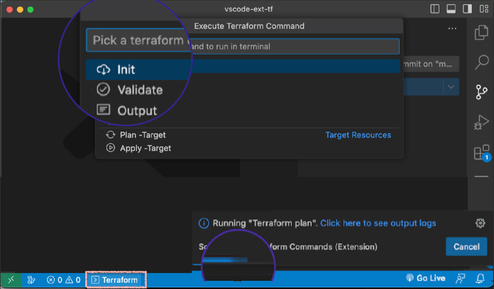

# Advanced Terraform Dashboard
Dramatically improves your terraform experience and productivity. Single-click launcher, real-time progress notifications and interactive ui.
# How to use

#### Click '⌘⇧T'

(Ctrl / Cmd + Shift + T)

That's it. You are ready to Go &nbsp;&nbsp; 🎉🎉🎉

 
<em>Quick Launcher Menu</em>

## Notes

* On non-bash terminals (e.g windows powershell) some features are disabled.
* Initial time estimates might not be accurate as the system needs to "learn" the execution times.

## Improvements

Notice any issues, or have an idea on how this extension can improve? Please let me know!

## License

[CC BY-NC-ND](LICENSE)

**Enjoy!**
