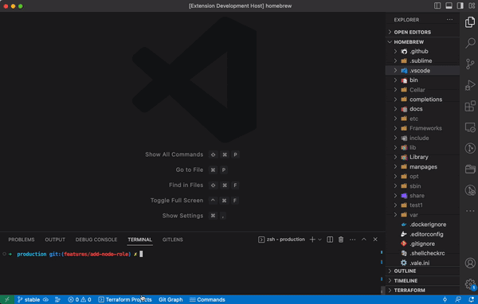

# [Terraform UI Plus](https://marketplace.visualstudio.com/items?itemName=oferkafry.easy-terraform-commands)

Supercharge your Terraform journey with a control center. Say goodbye to tedious typing! the [Terraform UI Plus](https://marketplace.visualstudio.com/items?itemName=oferkafry.easy-terraform-commands) VSCode extention brings effortless, UI-driven execution and real-time monitoring of Terraform commands.

# Features
* Effortlessly persist and retrieve terraform plan logs history.
* Work comfortably from within your code editor, unrestricted by the limitations of the integrated terminal.
* Seamlessly navigate and transition between all your Terraform projects.
* Visualize real-time execution progress of Terraform commands with a progress bar
* Get **Free** ChatGPT insight summary into "terraform plan"

# Demos

 
<em>Interactive Dashboard</em>

 
 

 
<em>From sidebar</em>

 
 

 
<em>A Quick Launcher and Progress indicator</em>

 

# How to use

#### Click "Terraform Projects" button in status bar
Or
#### Expand "Terraform" menu in side panel
Or
#### Click '⌘⇧T' (Ctrl / Cmd + Shift + T)

Then click desired command. That's it. You are ready to Go &nbsp;&nbsp; 🎉🎉🎉

 

## Notes
* On non-bash terminals (e.g windows cmd) some features are disabled.
* Initial time estimates might not be accurate as the system needs to "learn" the execution times.

## Improvements

Notice any issues, or have an idea on how this extension can improve? Please let me know!

## License

[CC BY-NC-ND](LICENSE)

**Enjoy!**
